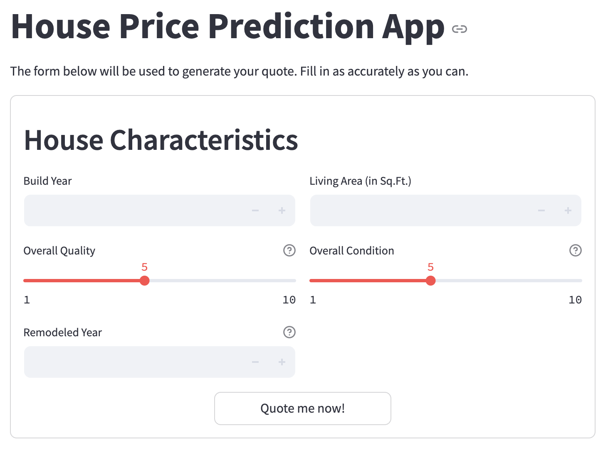

Getting started
===============

## Clone repo

Clone the repository into your favorite folder:
``` bash
git clone https://github.com/nikolaos-mavromatis/house-price-quoting-app.git
```

and navigate to it:
``` bash
cd house-price-quoting-app
```

## Setup Docker containers

Make sure you have docker installed. The easiest way is by [installing Docker Desktop](https://docs.docker.com/desktop/setup/install/mac-install/). A Docker Desktop installation will also install Docker Compose, which is used to spin up the containers.

``` bash
docker-compose build --no-cache #(1)!
docker-compose up -d #(2)!
```

1.  By default, Docker uses cached images to spin up the containers. `--no-cache` deactivates this behavior.
2.  `-d` flag keeps the containers running in the background and frees up the terminal.

This should result to the following :
``` bash
[+] Running 3/3
 ✔ Network house-price-quoting-app_housing-app     Created                 0.0s 
 ✔ Container house-price-quoting-app-app-1         Started                 0.2s 
 ✔ Container house-price-quoting-app-api-1         Started                 0.2s
```

!!! warning "Teardown"

    Once you are done experimenting, you can remove all containers and networks by running this command:

    ``` bash
    docker-compose down
    ```

    In this case, it should result to the following:
    ``` bash
    [+] Running 3/3
    ✔ Container house-price-quoting-app-app-1         Removed                 0.2s 
    ✔ Container house-price-quoting-app-api-1         Removed                 0.5s
    ✔ Network house-price-quoting-app_housing-app     Removed                 0.1s
    ```
## Use the app

Once the containers are up and running, visit [http://localhost:8501](http://localhost:8501) and experiment with the UI.

This is how it looks like:

{ width="80%"}
/// caption
The UI was made with Streamlit.
///
    
## Recap
After navigating to the project directory where the project will live, this is the full script to set it up from scratch.

``` bash
git clone https://github.com/nikolaos-mavromatis/house-price-quoting-app.git
cd house-price-quoting-app
docker-compose up -d
open http://localhost:8501/
```

!!! warning
    Don't forget to tear down everything after you have finished. The containers will eat up your memory otherwise.

    ``` bash
    docker-compose down
    ```
